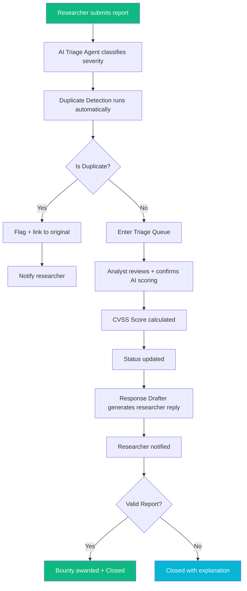
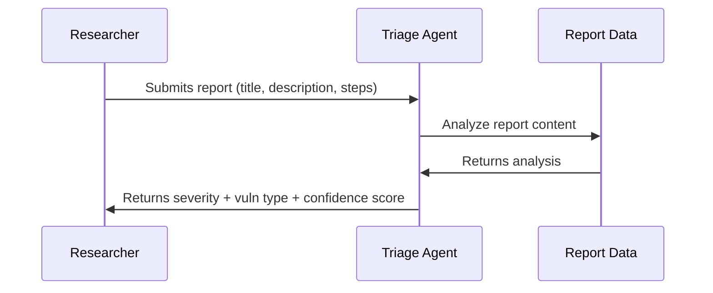
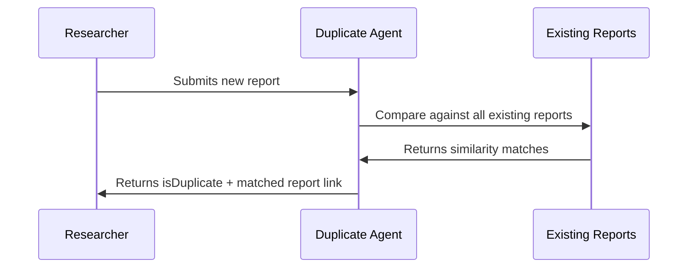
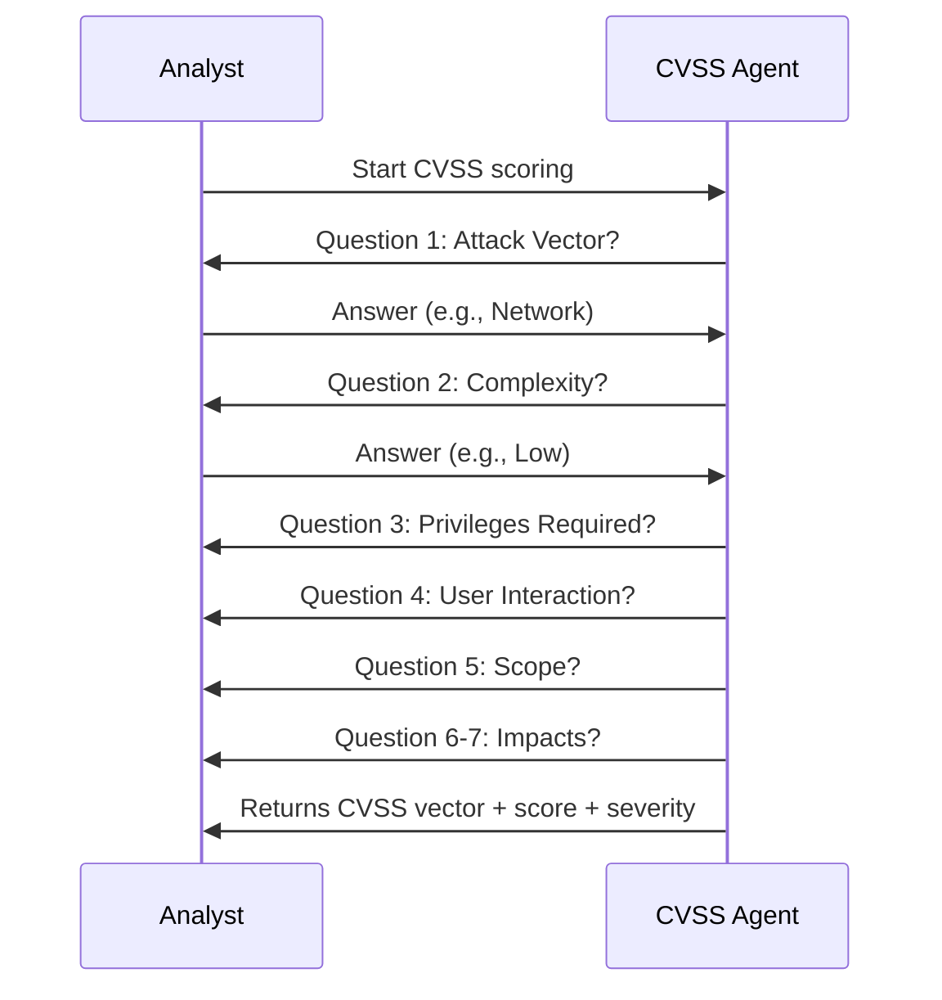
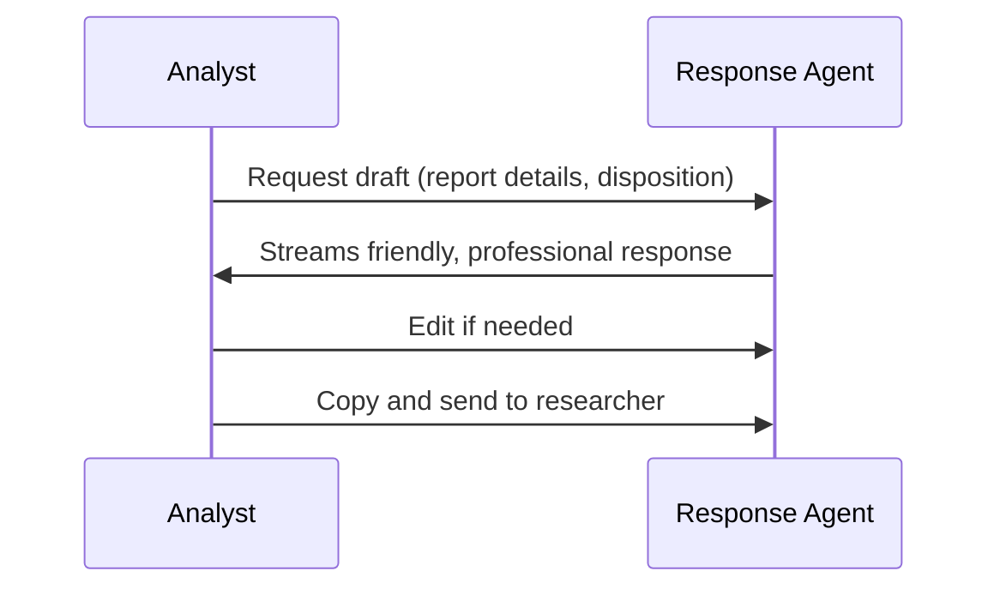
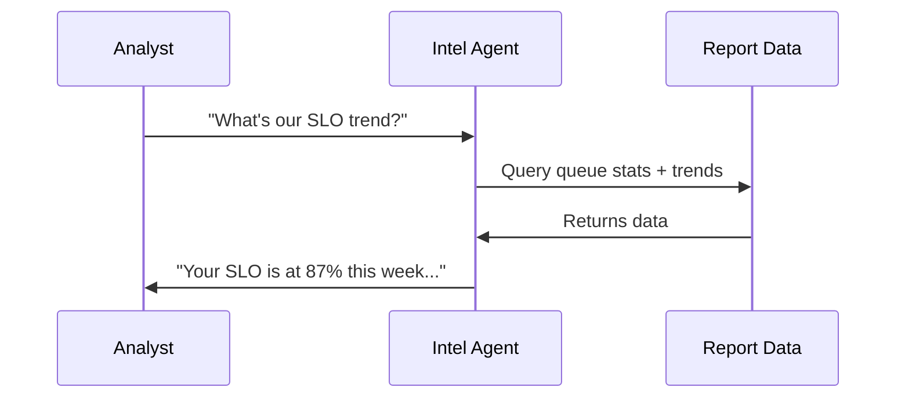
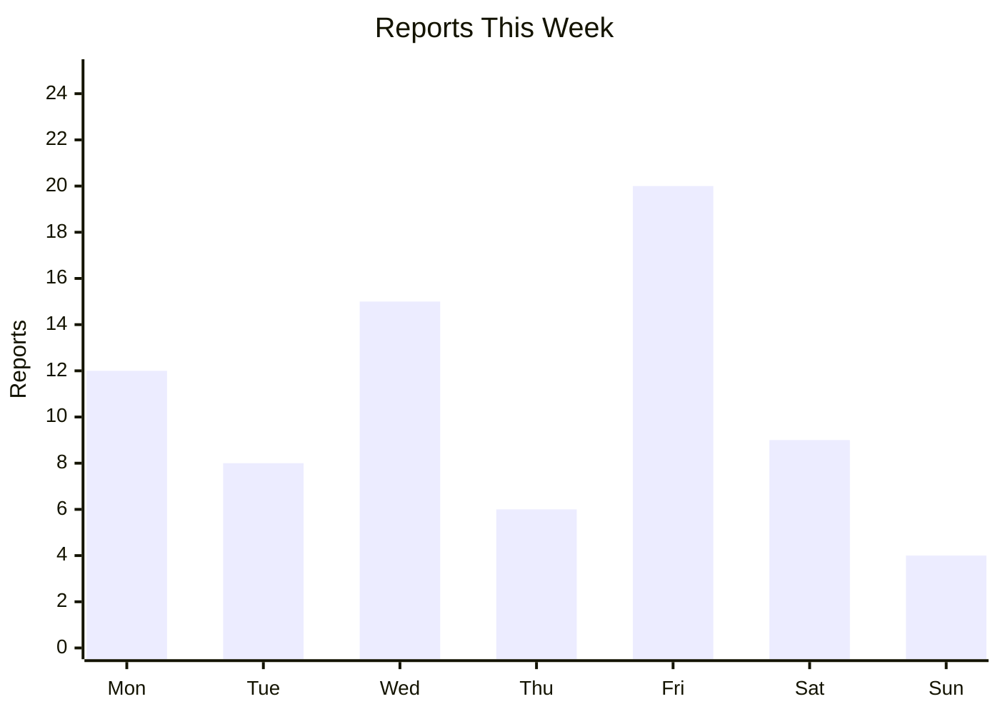
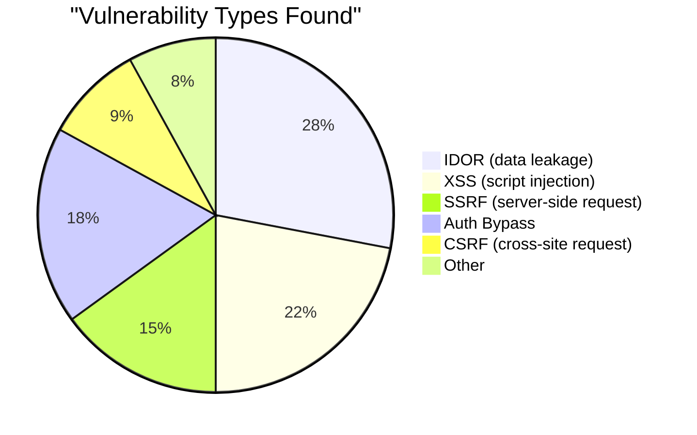
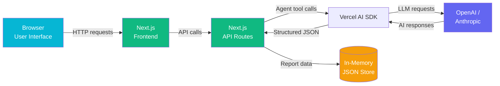

# BountyOps

**An AI-powered command center for managing security vulnerability reports — built for speed, clarity, and researcher trust.**

[](https://nextjs.org)
[](https://tailwindcss.com)
[](https://sdk.vercel.ai)
[](https://opensource.org/licenses/MIT)
[](https://github.com/AnandSundar/BountyOps)


## BountyOps Dashboard


[📖 Read the Docs](#)

---

## 🤔 What Is This?

A **bug bounty program** is when a company pays security experts (called "researchers") to find and report security holes in their software. Think of it like a reward system for digital detectives!

The problem is simple: security teams get flooded with vulnerability reports and need a way to sort, score, and respond to them fast. Without a system, important issues get lost in the noise and researchers wait weeks for a reply.

**BountyOps is the operations center that makes that possible.**

---

## ✨ Features Overview

| Feature | What It Does | Powered By |
|---------|--------------|------------|
| **Triage Queue** | A organized list of all incoming reports that can be filtered by severity, status, and type | React + TypeScript |
| **AI Triage Agent** | Instantly reads new reports and suggests severity level and vulnerability type | Vercel AI SDK + OpenAI |
| **Duplicate Detection** | Automatically checks if a new report is a duplicate of an existing one | Vercel AI SDK + OpenAI |
| **CVSS Scoring Agent** | Interactive chat that asks questions and calculates a standardized risk score (0-10) | Vercel AI SDK + OpenAI |
| **Response Drafter** | Generates professional, friendly responses to security researchers | Vercel AI SDK + OpenAI |
| **Program Intelligence Chat** | Ask questions about program health in plain English and get instant answers | Vercel AI SDK + OpenAI |
| **Submit a Report Form** | A public-facing form for researchers to submit vulnerability reports | React + Framer Motion |
| **Program Health Dashboard** | Real-time charts showing SLO compliance, report volume, and vulnerability breakdown | Recharts |

---

## 🗺️ How It Works



> 💡 **Every AI action is a suggestion — the human analyst always has final say.**

---

## 🤖 AI Agents Explained

### Triage Agent

The Triage Agent reads incoming vulnerability reports and suggests a severity level and vulnerability type.



**Why it matters:** Instead of manually reading every report, analysts get instant AI-powered suggestions that speed up the triage process by 10x.

---

### Duplicate Detection Agent

The Duplicate Detection Agent checks if the same issue was already reported.



**Why it matters:** Duplicate reports waste analyst time. Catching them automatically saves hours every week.

---

### CVSS Scoring Agent

The CVSS Scoring Agent asks 5 questions and calculates a standardized risk score (0-10).



**Why it matters:** CVSS is the industry standard for severity scoring. The agent makes it easy to calculate consistently.

---

### Response Drafter

The Response Drafter writes professional, friendly replies to security researchers.



**Why it matters:** Researchers appreciate fast, personalized responses. The agent ensures every reply is warm and specific.

---

### Program Intelligence Agent

The Program Intelligence Agent answers plain English questions about program health using live data.



**Why it matters:** Managers need instant answers about program health without digging through spreadsheets.

---

## 📊 Program Health Metrics

The Dashboard shows 4 key metrics that matter:

| KPI | What It Means |
|-----|---------------|
| **Open Reports** | How many reports are waiting to be reviewed right now |
| **SLO Compliance %** | The percentage of reports responded to on time (SLO = "we promise to reply within X days") |
| **Avg. Time to Triage** | How fast the team is reviewing reports on average |
| **Reports Closed This Week** | Weekly output — how many reports got resolved this week |

### Weekly Report Volume



### Vulnerability Distribution



---

## 🏗️ Architecture Overview

"How the pieces fit together."



- **Browser** → The user sees the React dashboard
- **Next.js Frontend** → Handles routing and UI rendering
- **Next.js API Routes** → Backend logic and agent endpoints
- **Vercel AI SDK** → Connects to OpenAI/Anthropic for AI capabilities
- **In-Memory Store** → Holds all report data (JSON file)

---

## 🚀 Getting Started

### Prerequisites
- Node.js 18 or higher
- An OpenAI or Anthropic API key

### Quick Setup

```bash
# Clone the repository
git clone https://github.com/AnandSundar/BountyOps.git

# Go into the folder
cd BountyOps

# Install dependencies
npm install

# Copy the example environment file
cp .env.example .env.local

# Add your OpenAI API key to .env.local
# OPENAI_API_KEY=your_key_here

# Start the development server
npm run dev
```

Then open **http://localhost:3000** in your browser.

> 💡 **No API key?** The app runs fully without one — AI features will show a friendly "unavailable" state and all manual workflows still work.

---

## 📁 Project Structure

```
bountyops/
├── app/                          # Next.js app router pages
│   ├── page.tsx                  # Dashboard with KPIs and charts
│   ├── reports/                  # Report Queue and detail views
│   ├── respond/                  # Response drafting center
│   ├── submit/                   # Public report submission form
│   ├── researchers/               # Researcher leaderboard
│   └── api/
│       └── agents/               # AI agent API routes
│           ├── triage/           # Triage agent
│           ├── duplicate-check/   # Duplicate detection
│           ├── cvss/            # CVSS scoring
│           ├── draft-response/   # Response drafter
│           └── intel/            # Program intelligence
├── components/                   # Reusable UI components
│   ├── ui/                       # Base components (buttons, badges, cards)
│   ├── layout/                   # Sidebar, header, footer
│   └── reports/                  # Report-specific components
├── lib/                          # Utilities and mock data
├── public/screenshots/           # Dashboard screenshots
└── data/                         # Mock vulnerability reports
```

---


## 🛣️ Roadmap

Potential future features:

- [ ] Real database backend (PostgreSQL via Supabase)
- [ ] Webhook integration with HackerOne / Bugcrowd APIs
- [ ] Email notifications to researchers on status change
- [ ] Role-based access (Analyst vs. Program Manager view)
- [ ] Export reports to PDF / CSV
- [ ] Multi-program support

---

## 🙋 About the Developer

Built by **Anand Sundar** — a Software Engineering professional and Agentic AI Security Engineer specializing in cybersecurity analytics, GRC frameworks, threat detection, and vulnerability management, with a strong foundation in secure system design and automation.

Links: [GitHub](https://github.com/AnandSundar) | [LinkedIn](https://www.linkedin.com/in/anandsundar96/)

This project was built to demonstrate real-world bug bounty operations skills, including triage workflows, AI-assisted severity scoring, and program health analytics.

---

## 📄 License

MIT License — see [LICENSE](LICENSE) for details.
